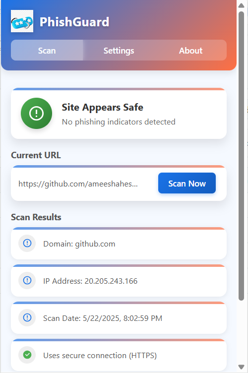
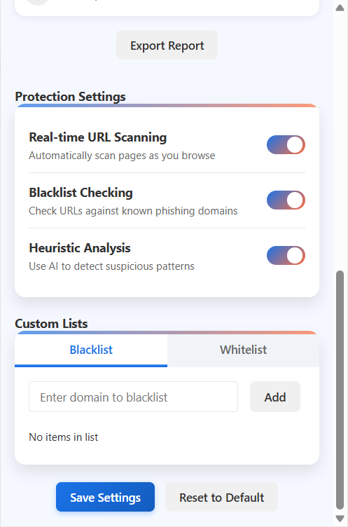

# 🛡️ PhishGuard - Phishing Detection Extension
  

PhishGuard is a modern, feature-rich Chrome extension that protects you from phishing and malicious websites using real-time analysis, domain age verification, SSL checks, and more. Its beautiful UI and actionable insights help you browse with confidence.

---

## 🚀 Features

- ⚡ **Real-time URL Scanning**: Instantly analyzes every page you visit or link you scan.
- 🏷️ **Domain Age Verification**: Uses WhoAPI to check if a domain is newly registered (a common phishing sign).
- 🔒 **SSL Certificate Validation**: Warns if a site has an invalid or missing SSL certificate.
- 🕵️ **Heuristic Phishing Detection**: Detects suspicious keywords, excessive subdomains, and more.
- 🗂️ **Blacklist & Whitelist**: Built-in and custom lists for trusted and dangerous domains.
- 🧑‍💻 **Context Menu Scan**: Right-click any link to scan it for phishing.
- 📋 **Exportable Reports**: Download a full security report for any scan.
- 🎨 **Modern UI**: Clean, responsive popup with tabs for Scan, Settings, and About.

---

## 🖼️ Screenshots
 <div style="display: flex; justify-content: center; align-items: center; gap: 20px; margin-top: 20px;">
    
    
</div>

## 🛠️ Installation

1. **Clone or Download** this repository.
2. Go to `chrome://extensions/` in your browser.
3. Enable **Developer mode** (top right).
4. Click **Load unpacked** and select the project folder.
5. Pin PhishGuard for quick access!

---

## 📦 Project Structure

```
Phishing_Link_Detector - 1/
├── background.js         # Background logic, scanning, API calls
├── content.js            # Content script for in-page detection
├── popup.html            # Main popup UI
├── popup.js              # Popup logic and UI updates
├── popup.css             # Modern, responsive styles
├── Manifest.json         # Chrome extension manifest
├── icons/                # Extension icons (16/48/128px)
└── test.js               # Test and mock logic
```

---

## 🧩 How It Works

PhishGuard analyzes every site you visit and every link you scan for:

- 🗓️ **Domain Age**: Checks if the domain is newly registered (via WhoAPI)
- 🌐 **Suspicious TLDs**: Flags risky domains like `.tk`, `.gq`, etc.
- 🔑 **Phishing Keywords**: Looks for words like `login`, `verify`, `bank`, etc.
- 🏢 **Excessive Subdomains**: Warns if a domain has too many subdomains
- 🔒 **SSL Certificate**: Validates HTTPS and certificate status
- 🕳️ **Hidden Form Fields**: Detects hidden fields that may steal credentials
- 🔗 **Redirect Chains**: Tracks suspicious redirects
- 🛑 **Blacklist**: Checks against known phishing domains

All results are shown in a beautiful popup with clear status, details, and export options.

---

## ⚙️ Settings & Customization

- **Enable/Disable** real-time scanning, blacklist, and heuristic checks
- **Manage** your own blacklist and whitelist
- **Export** scan reports for your records

---

## 📋 Permissions

PhishGuard requests the following permissions:
- `activeTab`, `storage`, `webNavigation`, `contextMenus`, `webRequest`, `<all_urls>`

These are required for real-time scanning, context menu actions, and storing your settings.

---

## 🧑‍💻 Developer Info

- **Author:** Ameesha Heshan (Nova Exzzr)
- **Version:** 1.0.0
- **License:** MIT

---

## 🙏 Acknowledgements

- [WhoAPI](https://whoapi.com/) for domain age data
- [Cloudflare DNS](https://developers.cloudflare.com/1.1.1.1/dns-over-https/) for IP resolution
- [Material Icons](https://fonts.google.com/icons) for UI icons

---

## 💡 Contributing

Pull requests and suggestions are welcome! Please open an issue or PR for improvements.

---

## 📞 Contact

For support or feedback, contact [Ameesha Heshan](mailto:ameeshaheshan@gmail.com)

---

## ⭐ If you like PhishGuard, give it a star!

